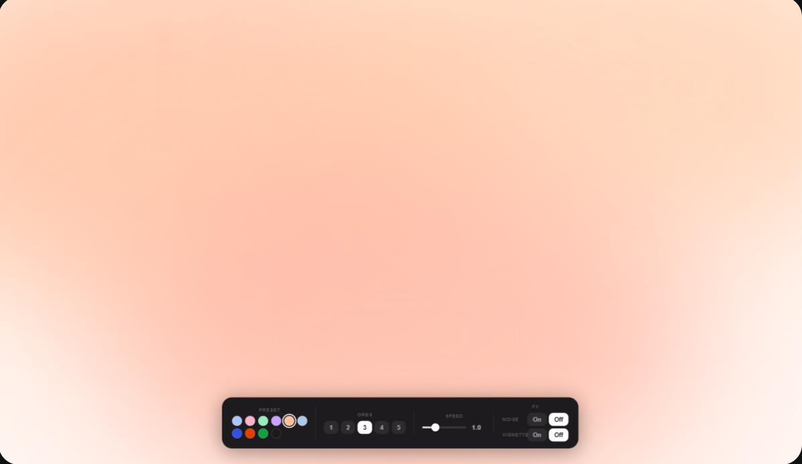

# Ambient Smooth Color Studio

> A premium, ultra-soft ambient background generator built from scratch with **HTML, CSS, and JavaScript** — no Framer, React, npm packages, frameworks, or external libraries.

Create calm, fluid, designer-style color atmospheres for landing pages, dashboards, hero sections, login screens, portfolios, creative websites, and digital products.

The project focuses on **soft color diffusion rather than visible animated blobs**. Large blurred color fields slowly overlap and move through the canvas, producing a smooth, almost liquid atmosphere.

---

## ✨ Preview



The interface is intentionally compact and inspired by professional visual-design controls: small typography, pill switches, circular color swatches, precise spacing, dark translucent glass, and a minimal floating control bar.

---

## 🎨 Design Philosophy

The main goal of this project is to create a background that feels:

- **Soft**
- **Premium**
- **Minimal**
- **Organic**
- **Slow**
- **Cinematic**
- **Non-distracting**
- **Easy to customize**

Instead of placing several obvious gradient circles on the screen, the renderer uses **very large color fields with heavy blur and low opacity**.

This removes hard edges and creates gradual transitions such as:

```text
Color A ────────────────┐
                        ├── Soft atmospheric blend
Color B ────────────────┤
                        ├── Diffused transition
Color C ────────────────┘
```

The result is intended to sit behind UI content without competing with it.

---

# 🚀 Features

## 🎨 Custom Color System

Choose the exact colors used by the ambient background.

### Built-in controls

- Circular color swatches
- Native browser color picker
- Add new custom colors
- Edit existing colors
- Up to **8 active color layers**
- Real-time color updates
- Smooth color transitions

Click a color swatch to edit it.

Click `+` to add another color.

The color system is designed so that users can experiment with completely different visual identities without changing the CSS manually.

---

## 🔢 Control How Many Colors Are Visible

The **SHOW** control allows you to decide how many ambient color layers should participate in the background.

Available values:

```text
1  2  3  4  5  6  7  8
```

### Example

**1 color**

Creates a very minimal monochromatic atmosphere.

**2–3 colors**

Good for subtle landing pages and product interfaces.

**4–6 colors**

Creates a richer premium ambient effect.

**7–8 colors**

Creates a more colorful, expressive background.

This gives the designer control over visual complexity without modifying the source code.

---

# 🌈 Smooth Color Rendering

The background is deliberately designed around **soft diffusion**.

Each color field uses:

- Large dimensions
- Radial gradients
- Heavy Gaussian-style blur
- Low opacity
- Screen/multiply blending
- Slow movement
- Overlapping color fields
- Soft center lighting

### Visual behavior

Instead of:

```text
🔵    🔴    🟢
```

the effect aims for:

```text
████████████████████
████ soft blended ███
██ color diffusion ██
████████████████████
```

There should be no obvious hard circle boundaries.

---

# 🌀 Organic Motion

The ambient fields move using long-duration CSS keyframe animations.

The movement is intentionally slow.

Typical animation durations are approximately:

```text
32s
36s
39s
40s
43s
46s
```

The different durations prevent all color fields from moving together.

This creates a more natural atmosphere instead of a repetitive animation loop.

### Motion characteristics

- Slow
- Non-linear
- Continuous
- Independent movement
- Different animation durations
- Different movement distances
- Scale variation
- Subtle mouse interaction

---

# ⚡ Speed Control

The floating control panel includes a real-time speed slider.

Current range:

```text
0.15 ─────────────── 2.00
```

### Lower speed

Creates a calm:

- Luxury
- Editorial
- Meditation
- Portfolio
- SaaS hero

style.

### Higher speed

Creates a more energetic:

- Creative
- Music
- Gaming
- Experimental
- Promotional

style.

The speed value is displayed numerically for precision.

---

# 🖱️ Mouse Interaction

The background reacts subtly to pointer movement.

The interaction uses a smoothed pointer position rather than directly moving the gradients.

This prevents:

- Jitter
- Sudden movement
- Excessive motion
- Distracting cursor-following behavior

The pointer movement is interpolated using `requestAnimationFrame()`.

Conceptually:

```text
Mouse Position
      ↓
Smooth interpolation
      ↓
Small movement offset
      ↓
Ambient color fields
```

The effect is intentionally subtle.

---

# 🎛️ FX Controls

The floating control panel includes three visual effects.

## Noise

Adds an extremely subtle procedural texture.

Purpose:

- Reduce overly digital gradients
- Add visual depth
- Create a slightly more organic finish

The effect can be disabled instantly.

---

## Vignette

Adds a soft darkening toward the edges.

Purpose:

- Focus attention toward the center
- Improve readability
- Add cinematic depth

The vignette can be turned off.

---

## Motion

Completely pauses the animated ambient fields.

Useful for:

- Static screenshots
- Accessibility
- Presentation mode
- Debugging
- Low-motion environments

---

# 🧩 Interface Design

The control panel follows a compact professional visual language.

### Panel

- Dark translucent surface
- Approx. `17px` corner radius
- Thin white border
- Soft shadow
- Backdrop blur
- Horizontal layout
- Compact vertical height
- Fixed bottom positioning

### Typography

The UI intentionally uses very small utility text.

Typical label characteristics:

```text
8px
uppercase
letter-spacing: 0.17em
font-weight: 700
```

This gives the controls a studio/tool-panel appearance.

### Color Swatches

Each color is represented by a small circular swatch.

Default size:

```text
16px × 16px
```

Active colors receive:

- White outer ring
- Subtle secondary ring
- Slight scale increase

### Buttons

The numeric controls use:

- Rounded corners
- Low-contrast dark surface
- Small typography
- Clear active state

---

# 🪟 Glassmorphism

The control panel uses a layered glass treatment:

```css
background: rgba(27, 24, 27, 0.93);
border: 1px solid rgba(255, 255, 255, 0.15);
backdrop-filter: blur(20px);
```

The visual hierarchy comes from:

1. Translucent background
2. Thin border
3. Backdrop blur
4. Soft shadow
5. Small high-contrast typography

The glass layer stays visually separate from the colorful ambient layer.

---

# 📐 Responsive Design

The interface is designed for:

- Desktop
- Laptop
- Tablet
- Mobile

On smaller screens, the control panel changes from a single horizontal row into a wrapped layout.

### Desktop

```text
┌──────────────────────────────────────────────────────────┐
│ COLOURS │ SHOW │ SPEED │ FX                              │
└──────────────────────────────────────────────────────────┘
```

### Smaller screens

Controls wrap into multiple rows while preserving the same visual hierarchy.

The panel also gets a constrained height with scrolling when necessary.

---

# ♿ Accessibility

The project includes several accessibility-friendly considerations.

### Reduced Motion

The stylesheet respects:

```css
@media (prefers-reduced-motion: reduce)
```

When reduced motion is requested, the ambient animations are disabled.

### Semantic controls

Interactive elements use real:

- `<button>`
- `<input type="range">`
- `<input type="color">`

elements instead of clickable `<div>` elements.

### State indication

FX switches update:

```text
aria-pressed
```

to communicate their current state.

---

# ⚡ Performance

The project intentionally avoids heavy rendering frameworks.

### No dependencies

There is no:

- React
- Vue
- Angular
- Framer
- GSAP
- Three.js
- WebGL library
- npm package
- CDN dependency

### Animation strategy

The primary animation work is performed using CSS keyframes.

Animated elements use:

```css
will-change: transform;
```

The pointer interaction uses:

```javascript
requestAnimationFrame()
```

instead of creating an uncontrolled mousemove animation loop.

### Rendering philosophy

The project favors:

```text
CSS animation
      ↓
GPU-friendly transform
      ↓
Blurred color field
```

rather than continuously recalculating the entire background in JavaScript.

> Note: heavy blur can still be GPU-intensive on very low-end devices. For performance-sensitive production pages, reduce the number of visible layers and blur radius.

---

# 🛠️ Technology

| Technology | Purpose |
|---|---|
| HTML5 | Structure and controls |
| CSS3 | Gradients, blur, animation, responsive UI |
| Vanilla JavaScript | Color management and interactions |
| CSS Keyframes | Ambient movement |
| CSS Variables | Dynamic color/speed configuration |
| Native Color Input | Custom color selection |
| `requestAnimationFrame()` | Smooth pointer interaction |

---

# 📁 Project Structure

```text
ambient-smooth-color-studio/
│
├── index.html
├── style.css
├── script.js
├── README.md
│
└── assets/
    └── ambient-preview.png
```

---

# 🧠 How It Works

## 1. Ambient Layer

The main `.ambient` container fills the entire viewport.

```css
.ambient {
  position: fixed;
  inset: -30%;
  overflow: hidden;
}
```

The oversized canvas prevents the edges of moving color fields from becoming visible.

---

## 2. Color Fields

Each `.orb` represents an independent color field.

```html
<div class="orb orb-1"></div>
<div class="orb orb-2"></div>
<div class="orb orb-3"></div>
```

The project currently supports up to 8 visual layers.

---

## 3. Soft Gradient

Each layer uses a radial gradient:

```css
background:
  radial-gradient(
    circle,
    var(--c1) 0 13%,
    rgba(255,255,255,0) 67%
  );
```

The field is then heavily blurred.

```css
filter: blur(110px);
```

This removes the obvious gradient boundary.

---

## 4. Dynamic Colors

Colors are controlled through CSS variables:

```css
--c1
--c2
--c3
--c4
--c5
--c6
--c7
--c8
```

JavaScript updates these variables when the user changes a color.

---

## 5. Layer Count

The user chooses how many fields are visible.

For example:

```text
SHOW 3
```

means only:

```text
orb-1
orb-2
orb-3
```

are visible.

---

# 🎨 Creating Your Own Palette

You can easily replace the default colors in `script.js`.

Example:

```javascript
let colors = [
  "#ffc6b2",
  "#ffb49e",
  "#ffd7c8",
  "#f6b7ad",
  "#ffe6da",
  "#ffccb9"
];
```

For a cool palette:

```javascript
let colors = [
  "#b8d8ff",
  "#8ec5ff",
  "#c4b5fd",
  "#99f6e4",
  "#bae6fd",
  "#ddd6fe"
];
```

For a warm palette:

```javascript
let colors = [
  "#ffb199",
  "#ff8f70",
  "#ffd6a5",
  "#f9c5d1",
  "#ffe0b2",
  "#ffcab0"
];
```

---

# 🎯 Recommended Color Counts

| Use Case | Recommended |
|---|---:|
| Minimal background | 1–2 |
| SaaS landing page | 2–4 |
| Portfolio | 3–5 |
| Premium dashboard | 3–4 |
| Creative website | 4–6 |
| Experimental visuals | 6–8 |

More colors do not automatically mean a better result. The best backgrounds usually use a small number of carefully selected colors.

---

# 🔧 Customization

## Change Blur

In `style.css`:

```css
--blur: 110px;
```

### Softer

```css
--blur: 150px;
```

### More defined

```css
--blur: 70px;
```

---

## Change Background Base

```css
body {
  background: #fff5f0;
}
```

You can use:

```css
background: #ffffff;
```

for a clean white atmosphere or:

```css
background: #08090d;
```

for a dark atmosphere.

---

## Change Panel Position

The default panel is centered horizontally at the bottom.

```css
.panel {
  left: 50%;
  bottom: 24px;
  transform: translateX(-50%);
}
```

---

# 📦 Installation

No installation is required.

### Option 1 — Direct

Download the repository and open:

```text
index.html
```

### Option 2 — VS Code

Open the folder in VS Code and run it with Live Server.

### Option 3 — Static Hosting

Because the project is completely static, it can be deployed to:

- GitHub Pages
- Vercel
- Netlify
- Cloudflare Pages
- Any static web server

No build step is required.

---

# 🌐 Browser Compatibility

The project is designed for modern browsers supporting:

- CSS gradients
- CSS transforms
- CSS animations
- `backdrop-filter`
- Native color input
- `requestAnimationFrame`

Recommended browsers:

- Chrome
- Edge
- Firefox
- Safari

`backdrop-filter` support may vary on older browsers. The interface still has a readable fallback background.

---

# 📱 Device Support

Designed for:

```text
Desktop       ✓
Laptop        ✓
Tablet        ✓
Mobile        ✓
Touch input   ✓
High DPI      ✓
Reduced motion ✓
```

---

# 🔒 Privacy

This project is completely client-side.

It does not:

- Send colors to a server
- Track users
- Store personal information
- Use analytics
- Load external assets
- Call APIs

Everything runs locally in the browser.

---

# 🧪 Design Tokens

The current visual language is approximately:

| Property | Value |
|---|---|
| Panel radius | `17px` |
| Panel blur | `20px` |
| Panel border | `1px` |
| Color swatch | `16px` |
| Control radius | `7px` |
| Panel shadow | Soft / low contrast |
| Ambient blur | `110px` |
| Default speed | `0.70` |
| Color layers | `1–8` |
| Base background | Warm off-white |

These values are intentionally easy to modify.

---

# 📸 Screenshot Assets

The repository includes the preview image used in this README:

```text
assets/ambient-preview.png
```

You can replace it with your own screenshot after customizing the project.

For GitHub, additional screenshots can be placed inside:

```text
assets/
```

and embedded with:

```markdown

```

---

# 💡 Possible Future Improvements

The architecture makes it easy to add:

- Palette presets
- Random palette generation
- HEX / RGB / HSL input
- Color removal
- Drag-to-reorder colors
- Save/load palettes
- LocalStorage persistence
- Export configuration as JSON
- Copy CSS variables
- Copy generated CSS
- Fullscreen preview
- Dark mode
- Gradient direction controls
- Blur intensity control
- Orb size control
- Animation direction
- Animation easing controls
- Screenshot export
- URL-based palette sharing

---

# 📜 License

This project is provided as an open-source creative experiment.

You may modify the HTML, CSS, and JavaScript for your own projects.

If you publish a modified version, keeping attribution to the original project is appreciated.

---

# 👨‍💻 Author

**Ambient Smooth Color Studio**

Designed and developed as a lightweight vanilla web experiment focused on creating premium ambient backgrounds without framework dependencies.

---

## ⭐ If You Like It

If this project helps you create something beautiful, consider giving the repository a ⭐ on GitHub.

**Built with HTML + CSS + JavaScript.**

No Framer.  
No React.  
No dependencies.  
Just smooth colors.
